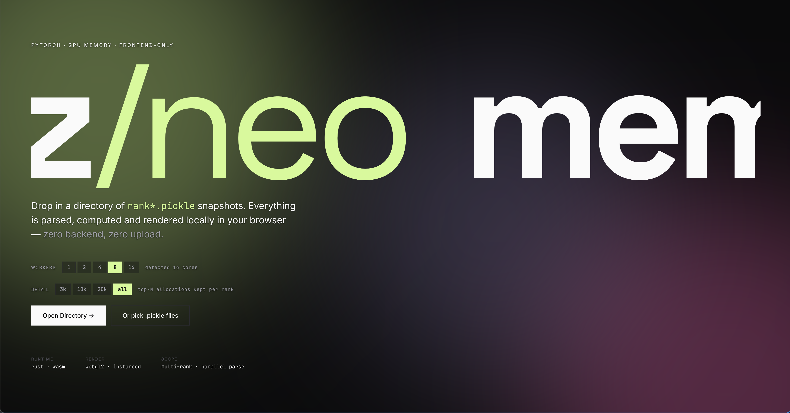
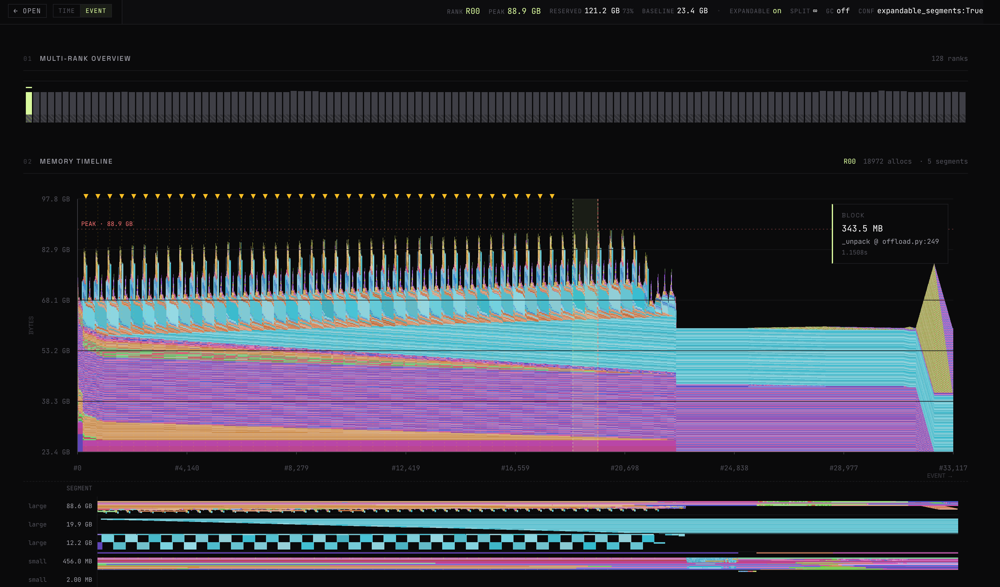
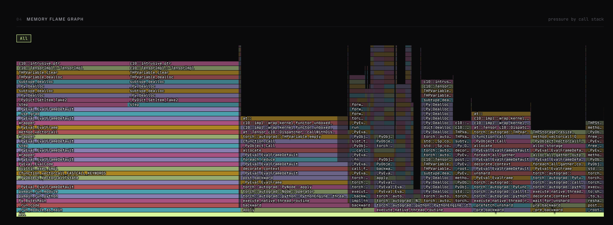

<div align="center">


Drop `rank*.pickle`s into the page — everything parses, computes and renders
locally. No backend, no upload, no waiting on someone else's server.

### [→ Open the app at junjzhang.github.io/memviz-neo ←](https://junjzhang.github.io/memviz-neo/)

[](./LICENSE)
[](#architecture)



> 100% vibecoded. Not a single line written by a human. Prompts all the way down.

</div>

---

## Why

PyTorch's `torch.cuda.memory._dump_snapshot()` spits out a pickle per rank.
The data is gold; the default viewer makes it hard to see. `memviz/neo` is a
rebuild around three ideas:

1. **Multi-rank at once.** Parse every rank of the run in parallel in the
   browser; the dashboard shows the first one that finishes and the rest
   stream in behind it.
2. **WebGL2 for the plots.** Every allocation's lifetime is an instanced
   strip — 50 k+ allocs pan/zoom at 60 fps without breaking a sweat.
3. **Same pickle, better lenses.** Address-reuse-aware selection,
   cross-linked Memory + Segment timelines, call-stack flame graph weighted
   by `bytes × lifetime`, per-rank peak bars.



## How it compares

|                                   | [pytorch/memory_viz][pv] | [desktop_memory_viz][cj] | **memviz/neo**                        |
| --------------------------------- | ------------------------ | ------------------------ | ------------------------------------- |
| Runs in                           | browser, static site     | native Rust desktop app  | **browser, static site**              |
| Install                           | — (URL)                  | `cargo build` + Python   | **— (URL)**                           |
| Pickle path                       | JS unpickler in-browser  | Python pre-extract → JSON, then Rust | **Rust → WASM with frame interning** |
| Renderer                          | SVG via D3               | eframe / egui (wgpu)     | **WebGL2 instanced**                  |
| Multi-rank view                   | pickle dropdown, one at a time | single file             | **whole run in parallel on a worker pool** |
| Views                             | Active / Segment / State / Settings | Active Memory Timeline only | **Multi-rank · Memory · Segment · Flame · Anomalies** |
| Call-stack flame (bytes × lifetime) | —                     | —                        | **✓**                                 |
| Cross-view selection linking      | —                        | —                        | **timeline ↔ segment ↔ detail panel** |
| Address-reuse-aware selection     | —                        | —                        | **keyed on `(addr, alloc_us)`**       |

### Parse-phase benchmark

Same 12.1 MiB pickle (50 k trace events, 90 segments) on one machine.
Each tool parses different amounts of work up front — the table shows
what each one actually does before the UI becomes interactive.

|                                          | time     | work done |
| ---------------------------------------- | -------- | --------- |
| `pytorch` `unpickle` + `annotate_snapshot` | ~163 ms  | decode + alloc/free version stamping |
| `desktop_memory_viz` Python `extract_snapshot.py` | ~1588 ms | decode + JSON dump for native viewer |
| `memviz/neo` `parse_intern` (all)        | ~1040 ms | decode + frame/stack interning + alloc/free pairing + top-N + IR emit |

pytorch defers almost everything to view-open time — d3 walks the JS
object tree every time the user switches to a view. memviz/neo front-loads
all of it: frames intern down from 3.5 M entries to ~1400 unique
(`u32` per event after that), allocs get paired with orphan-baseline
reconstruction, top-N gets sorted, and the layout worker receives a
pre-baked IR so it never revisits the pickle.

Net: **pytorch parses faster, memviz/neo switches views faster.** At the
run level the single-pickle gap closes — pytorch shows one pickle at a
time (8 × 180 ms sequential ≈ 1440 ms), memviz/neo races an 8-rank
snapshot through 8 workers and finishes in ~1000 ms wall-clock.

### Render benchmark

Same pickle, end-to-end via `bench/render.mjs --headed` (Framework laptop,
Intel iGPU, 120 Hz display, ~18 k allocs in the default view):

|                 | value |
| --------------- | ----- |
| `T_parse`       | ~1200 ms (pickle → summary in store) |
| `T_render`      | ~2100 ms (layout worker O(N²) + React mount + WebGL2 init) |
| JS heap used    | ~420 MiB |
| Total UA memory | ~555 MiB |
| Idle FPS        | 120 fps · frame p95 = 8.3 ms |
| Pan 'd' 5 s     | 120 fps · frame p95 = 8.3 ms |
| Zoom 'w' 3 s    | 120 fps · frame p95 = 8.3 ms |

Frame budget on a 120 Hz display is 8.3 ms — all three gestures hit it
with no p95 spike even with ~18 k allocations in view.

Reproduce with `node bench/memviz.mjs`, `node bench/pytorch.mjs`,
`node bench/desktop.mjs`, `node bench/render.mjs` — see
[`bench/README.md`](./bench/README.md).

[pv]: https://docs.pytorch.org/memory_viz
[cj]: https://github.com/C-J-Cundy/desktop_memory_viz

## Views at a glance

**Multi-Rank Overview** — one bar per rank, heights scale on the peak (not
end-of-window), click to switch focus. Parsing is truly parallel, so on a
128-rank run the dashboard paints the moment *any* worker reports back.

**Memory Timeline** — WebGL2 instanced strip rendering of every allocation
in the top-N. `WASD` to pan/zoom X, `Shift+WASD` for Y, drag a box to zoom
both axes, `R`/`T`+drag for memory/time rulers, double-click to reset.
X-axis toggles between wall-clock μs and alloc/free event ordinal so dense
training phases stretch out instead of collapsing into a smear.

**Segment Timeline** — one row per caching-allocator segment, allocs drawn
at their in-segment offset. Pan/zoom locks to the Memory Timeline.
Selecting an alloc expands its segment row from 30 → 120 px so small
allocs inside big segments become actually readable.

**Anomalies** — flags pending-free stalls (`free_requested` but not
`free_completed`, usually a cross-stream sync hiccup) and leak suspects
(large long-lived allocs still alive at snapshot). Each anomaly cross-links
back to the timeline for a zoom-to-spot focus.

**Memory Flame Graph** — call-stack rolled up by `bytes × lifetime`, so
the paths that hold memory longest dominate the view. Drill-in breadcrumb,
hover tooltip, all in the same six-hue theme palette as the rest of the
dashboard.



## Usage

1. Open the site, or run locally (see below).
2. Click **Open Directory** and point it at a folder of `rank*.pickle` files.
   Firefox/Safari fall back to **Pick .pickle files** (multi-select).
3. Pick a worker count and a detail level (`3k` / `10k` / `20k` / `all`
   top-N allocations kept per rank), then let it rip.

Nothing leaves your machine. The WASM parser runs in a `Worker`, rendering
is WebGL2 on your GPU, and there is no `fetch()` that isn't the bundle
itself.

## Architecture

```
rank*.pickle ──► Parse worker ──► Rust/WASM pickle parser ──► interned frames / stacks
                                                            │
                                                            ├─► timeline strips (Float32Array, event + time variants)
                                                            ├─► segment rows (per-segment alloc buckets)
                                                            ├─► flame graph (stack-weighted prefix trie)
                                                            └─► anomalies (leak + pending-free flags)

main thread ──► Zustand stores ──► React views ──► WebGL2 instanced draw
```

- **Rust + `wasm-bindgen`** for the pickle parser (`wasm/`). No
  `serde_pickle`; a hand-rolled streaming parser with `Rc`-shared values
  handles PyTorch's heavy `MEMOIZE` / `BINGET` reuse without cloning
  megabytes of frame lists.
- **Frame / stack interning** end-to-end: a rank with 3.5 M frame entries
  collapses to ~1400 unique frames and a few hundred unique stacks, one
  `u32` per event.
- **Worker pool**, per-rank parse + layout in parallel. Parse workers race;
  first rank back drives the dashboard. Configurable from 1 to
  `hardwareConcurrency`.
- **Pre-packed GPU buffers** — timeline strips ship as a single
  `Float32Array` with event-mode *and* time-mode variants precomputed, so
  the X-axis toggle is one `bufferData` call.
- **Address-reuse-aware selection** — keys off `(addr, alloc_us)`, not
  `addr` alone, so clicking a block doesn't pick up a *different* alloc
  that happened to land at the same GPU address later.
- **React 19 + Zustand + AntD (dark)**, Vite + `vite-plugin-wasm`.

## Develop

Prereqs: `rustup target add wasm32-unknown-unknown`, `wasm-pack`, `pnpm`,
Node 22.

```bash
cd web
pnpm install
pnpm dev          # auto-builds wasm if pkg/ is missing
```

Other commands:

```bash
pnpm build:wasm   # wasm-pack build --release
pnpm build        # typecheck + vite build (runs build:wasm first)
```

Synthetic snapshots for perf work:

```bash
python scripts/gen_test_data.py --ranks 8 --events 20000 --out test_data/
```

## Deploy

`main` auto-deploys to GitHub Pages via
[`.github/workflows/deploy-pages.yml`](./.github/workflows/deploy-pages.yml)
(builds WASM + Vite with `VITE_BASE=/memviz-neo/`). First-time setup only
needs **Settings → Pages → Source: GitHub Actions**.

## Acknowledgements

Prior art that made this project possible (and obvious to want):

- [pytorch/memory_viz](https://docs.pytorch.org/memory_viz) — the official
  snapshot viewer. Defined the pickle schema this project consumes and set
  the baseline for what "good enough" memory visualization looks like.
- [C-J-Cundy/desktop_memory_viz](https://github.com/C-J-Cundy/desktop_memory_viz)
  — a desktop-grade rework of the same viewer. Showed that the official
  tool's UX could be pushed a lot further, and seeded several of the
  interactions here.

`memviz/neo` is the browser-native, multi-rank take on the same problem.

## License

[0BSD](./LICENSE) — take it, ship it, no attribution required.
